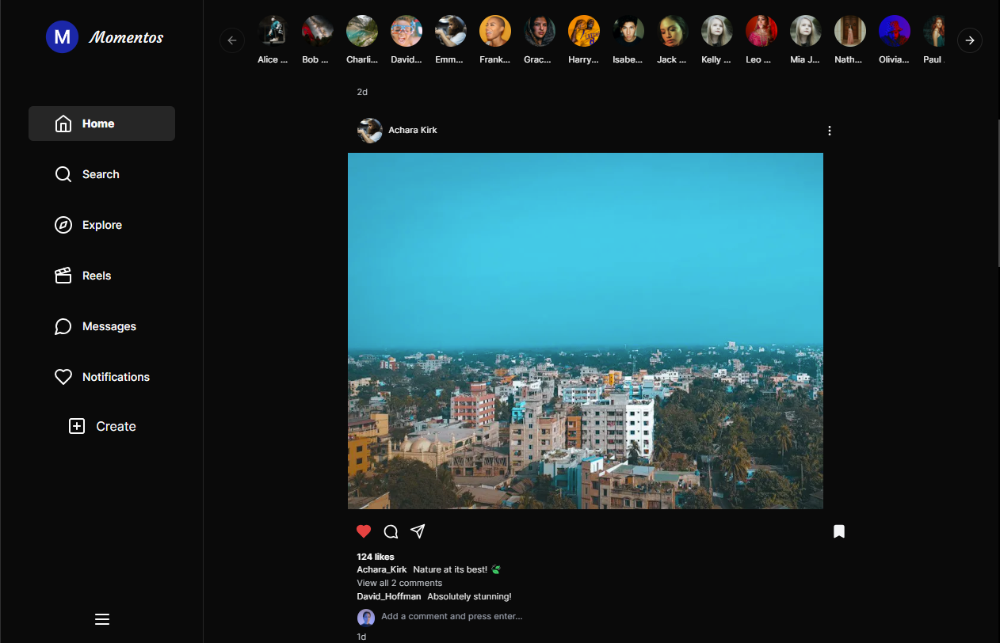
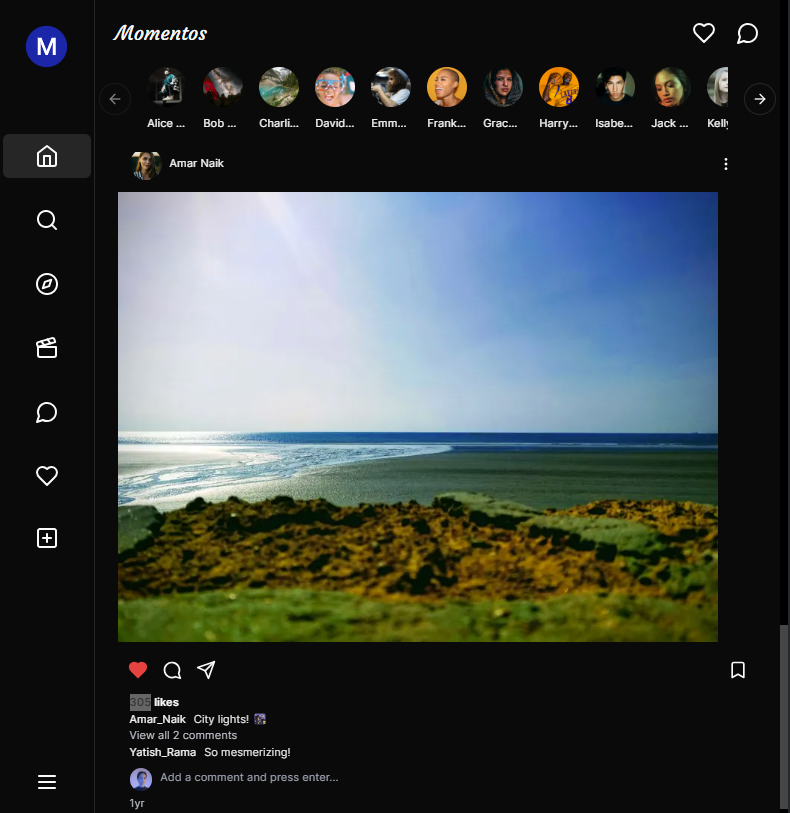
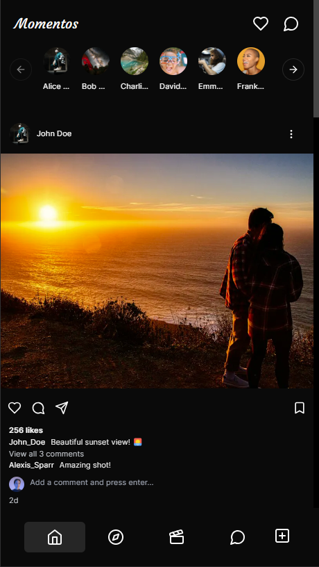
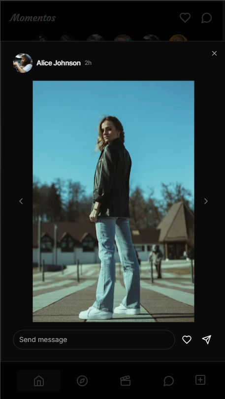
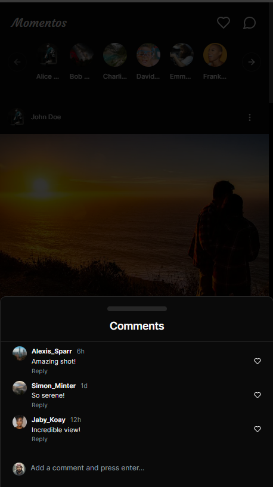

# Momentos Web App

A social media app.

## [Demo Link](https://momentos-kappa.vercel.app/feed) 🔗

<div align="center">
  
  
  
  
  
  <br>
</div>

## Technologies used 🛠️

- **HTML** 🚀
- **CSS** 🚀
- **JavaScript** 🚀
- **Tailwind CSS** 🚀
- **React JS** 🚀
- **Next JS** 🚀
- **Vercel** 🚀
- **Shadcn** 🚀

## Features

- ### **Stories Carousel 💯**
- ### **Like Dislike🥳**
- ### **Comments on posts🤘**
- ### **Comment view / drawer 🙌**
- ### **Responsive 🙌**

---

## How To Use 🔧

From your command line, first clone this repo:

```bash

# Clone this repository
$ git clone https://github.com/dev-vivekkhanal/momentos.git

# Go into the repository
$ cd Momentos

# Remove current origin repository
$ git remote remove origin

```

Then you can install the dependencies

Using NPM:

```bash

# Install dependencies
$ npm install

# Run app locally
$ npm run dev
```

## Author 👨‍💻

- **Vivek Khanal** - **[Linkedin](https://www.linkedin.com/in/vivek-khanal-793016231/)**, **[Github](https://github.com/dev-vivekkhanal)**, **[Portfolio](https://portfolio-v1-nextjs.vercel.app/)**

---
